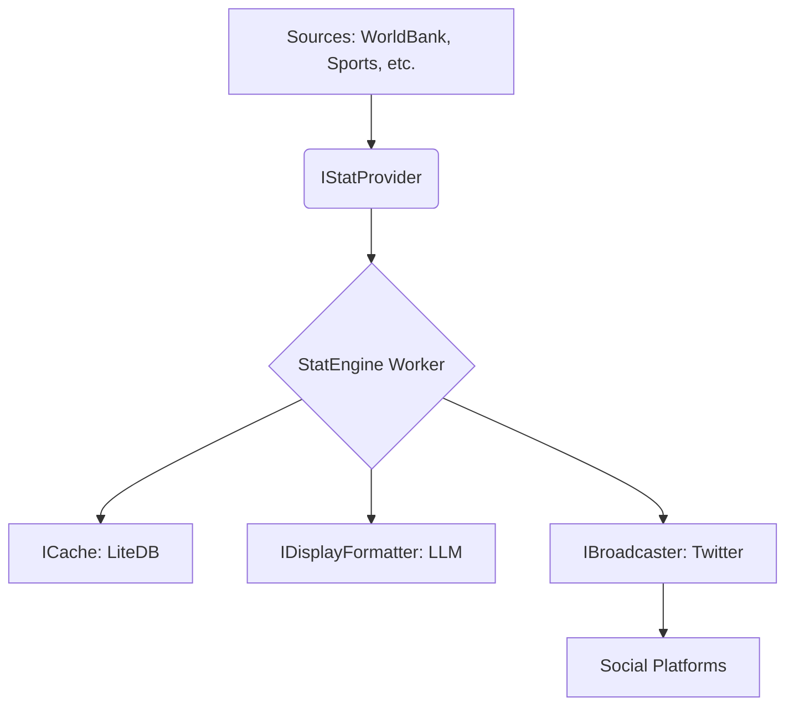

# 🚀 StatEngine: Resilient Data Ingestion & Broadcasting

[](https://dotnet.microsoft.com/)
[](https://opensource.org/licenses/MIT)
[]()

**StatEngine** is a high-performance, decoupled, and observable engine designed to ingest vast statistics from across the globe and broadcast them to social platforms with an AI-powered human touch.

---

## 🌟 Key Features

-   **🔍 Multi-Domain Ingestion**: Seamlessly fetches data from Education, Fashion, Lifestyle, Finance, Sports, and more.
-   **🤖 AI Humanization**: Uses **Semantic Kernel** & **GPT-4o-mini** (or local Ollama) to transform raw data into witty, engaging social content.
-   **🛡️ Industrial Resilience**: Powered by **Polly** for exponential backoff, circuit breaking, and transient error handling.
-   **⚡ High Performance**: Built on .NET 10 with a "Producer-Consumer" workflow optimized for low resource footprint.
-   **📦 Decoupled Design**: Pure **Hexagonal Architecture** (Ports & Adapters) ensures the engine is future-proof and easy to extend.
-   **💾 Smart Deduplication**: Integrated **LiteDB** NoSQL cache prevents duplicate broadcasts.

---

## 🏗️ Architecture



---

## 🚀 Quick Start

### 1. Requirements
-   [.NET 10 SDK](https://dotnet.microsoft.com/download)
-   Twitter Developer Tokens
-   OpenAI API Key (or [Ollama](https://ollama.com/) for a 100% free experience)

### 2. Configuration
The engine is configured via **Environment Variables** for maximum security.

```powershell
# Set your keys
$env:STATENGINE_OPENAI_API_KEY = "sk-..."
$env:STATENGINE_TWITTER_CONSUMER_KEY = "..."
```

See the [Setup Guide](brain/setup_guide.md) for a full step-by-step walkthrough.

### 3. Run
```powershell
dotnet run --project StatEngine.Worker
```

---

## 📂 Project Structure

-   **`StatEngine.Core`**: The Heart. Domain models and interface contracts.
-   **`StatEngine.Infrastructure`**: The Muscle. Concrete implementations for APIs, DBs, and LLMs.
-   **`StatEngine.Worker`**: The Brain. Orchestration and the main execution loop.

---

## 🛡️ License
Distributed under the MIT License. See [LICENSE](LICENSE) for more information.

---

Built with ❤️ by **Antigravity** for **@_royal001**
