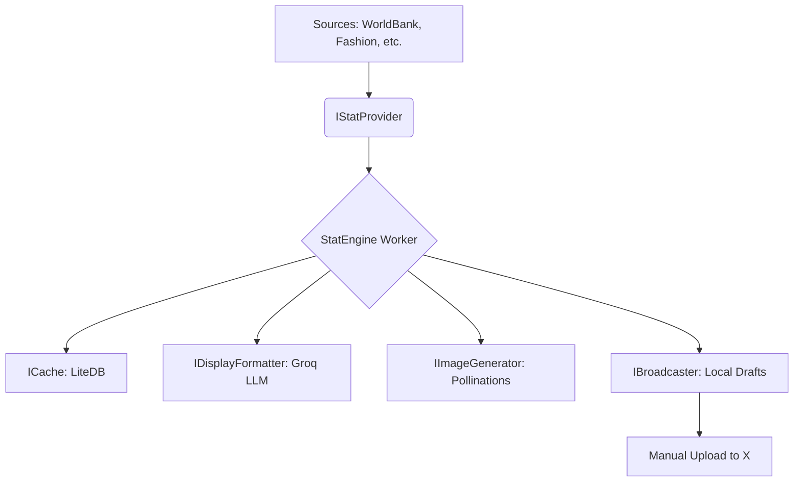

# 🚀 StatEngine: Resilient Data Ingestion & Broadcasting

[](https://dotnet.microsoft.com/)
[](https://opensource.org/licenses/MIT)
[]()

**StatEngine** is a high-performance, decoupled, and observable engine designed to ingest vast statistics from across the globe and broadcast them to social platforms with an AI-powered human touch.

---

## 🌟 Key Features

-   **🔍 Multi-Domain Ingestion**: Seamlessly fetches data from Education, Fashion, Lifestyle, Finance, Sports, and more.
-   **🚀 100% Free AI (Groq)**: Uses **Groq** (Llama 3.3) for lightning-fast, zero-cost content refinement.
-   **📷 Automated Image Generation**: Integrated **Pollinations.ai** to create relatable visuals for every statistic automatically.
-   **📝 Manual Draft Workflow**: Saves tweets and images locally to bypass Twitter Free Tier API restrictions.
-   **🛡️ Industrial Resilience**: Powered by **Polly** for exponential backoff and circuit breaking.
-   **⚡ High Performance**: Built on .NET 10 with a "Producer-Consumer" workflow.
-   **📦 Decoupled Design**: Pure **Hexagonal Architecture** for ultimate extensibility.
-   **💾 Smart Deduplication**: Integrated **LiteDB** NoSQL cache prevents duplicate posts.

---

## 🏗️ Architecture



---

## 🚀 Quick Start

### 1. Requirements
-   [.NET 10 SDK](https://dotnet.microsoft.com/download)
-   [Groq API Key](https://console.groq.com/) (100% FREE)
-   Twitter Account (Manual posting ready!)

### 2. Configuration
The engine is configured via **Environment Variables** or `appsettings.Development.json`.

```powershell
# Set your free Groq key
$env:STATENGINE_GROQ_API_KEY = "gsk_..."
```

See the [Setup Guide](brain/28c86f20-d838-4563-bb2b-185f9de822cb/setup_guide.md) for the full workflow.
Copyright (c) 2026 Ayomide-R

### 3. Run
```powershell
dotnet run --project StatEngine.Worker
```
After running, find your ready-to-post content in the `StatEngine.Worker/drafts/` folder!

---

## 📂 Project Structure

-   **`StatEngine.Core`**: The Heart. Domain models and interface contracts.
-   **`StatEngine.Infrastructure`**: The Muscle. Concrete implementations for APIs, DBs, and LLMs.
-   **`StatEngine.Worker`**: The Brain. Orchestration and the main execution loop.

---

## 🛡️ License
Distributed under the MIT License. See [LICENSE](LICENSE) for more information.

---

Built with ❤️ by **[Ayomide-R](https://github.com/Ayomide-R)**
